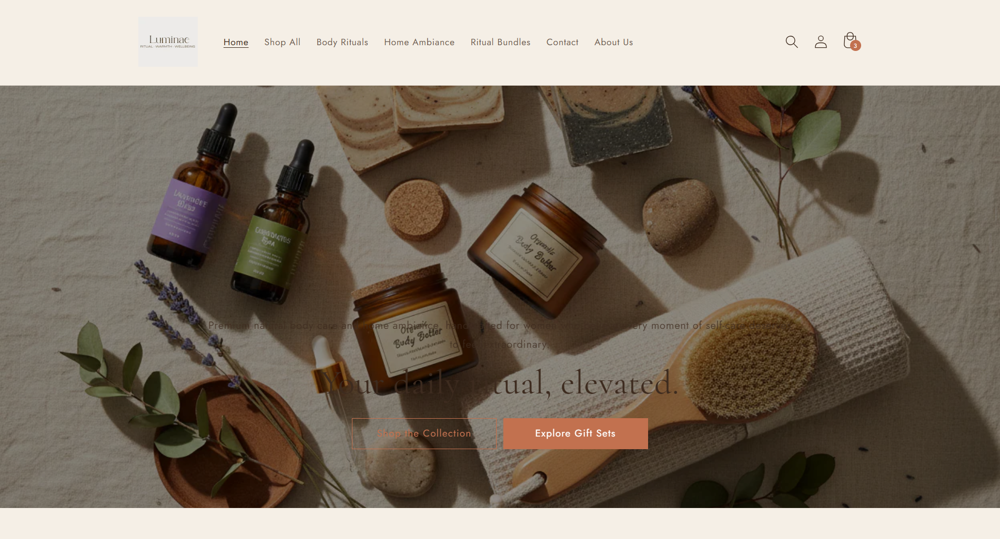
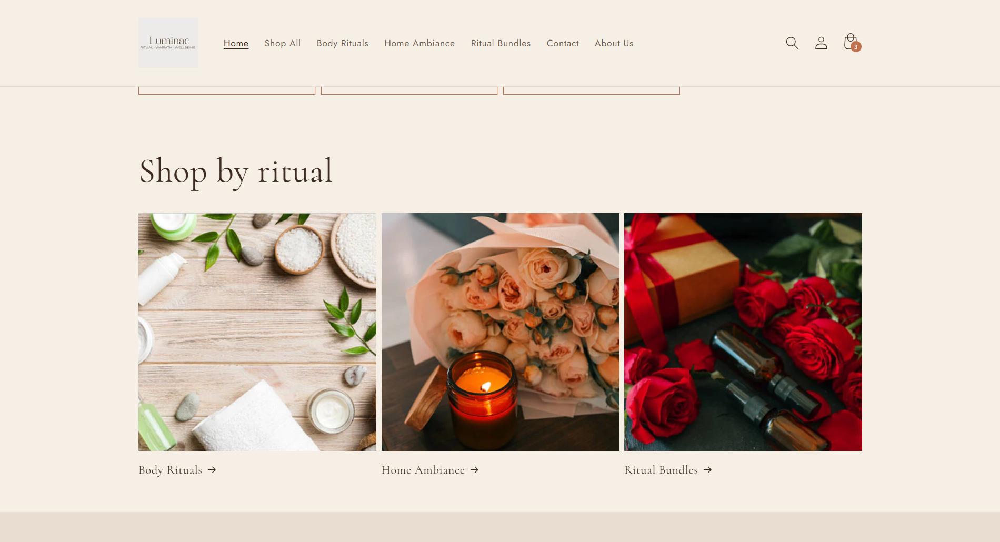
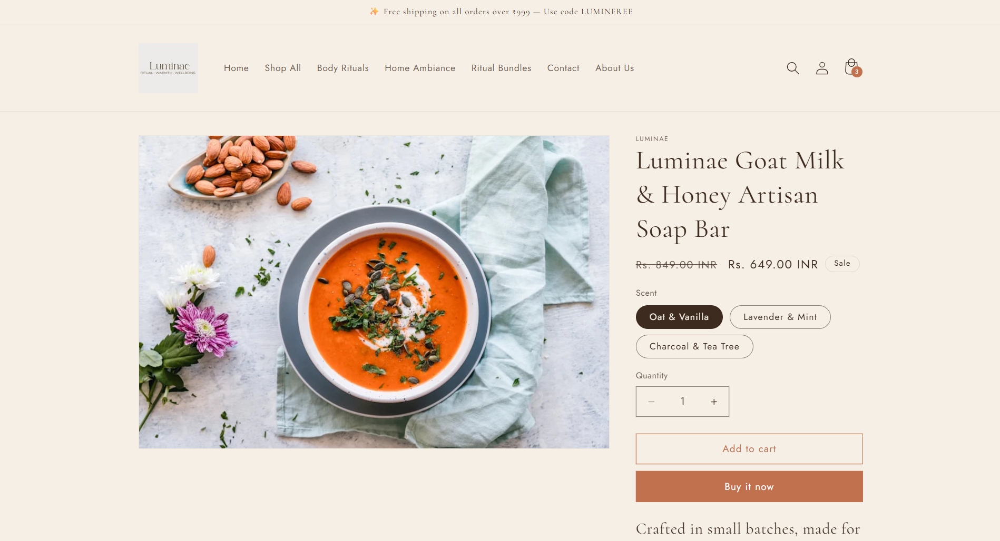
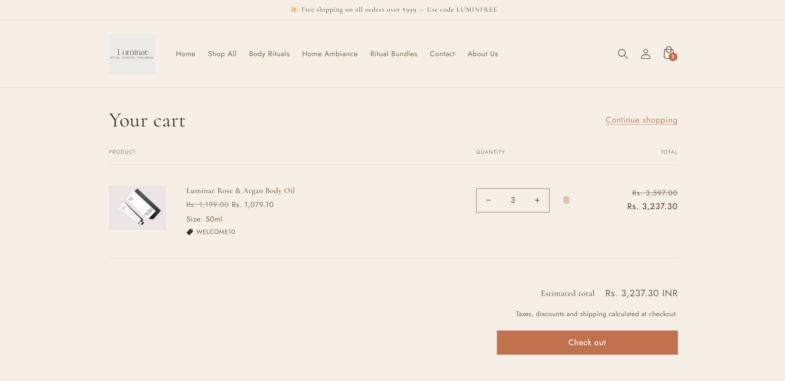
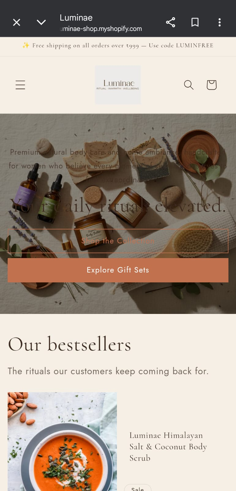

# 🌿 Luminae — Premium Shopify Store

<div align="center">


**A complete, professional Shopify store built from scratch in 2 days**

[](https://luminae-shop.myshopify.com)
[](#)
[](YOUR_YOUTUBE_LINK)
[](YOUR_GITHUB_LINK)

</div>

---

## 📋 Table of Contents

- [About the Project](#about)
- [Live Demo](#demo)
- [Brand Identity](#brand)
- [Store Structure](#structure)
- [Products](#products)
- [Apps Installed](#apps)
- [Homepage Sections](#homepage)
- [Store Pages](#pages)
- [Discount Codes](#discounts)
- [QA & Testing](#qa)
- [Tech Stack](#tech)
- [Files Included](#files)
- [Setup Guide](#setup)
- [Screenshots](#screenshots)

---

## 🌿 About the Project <a name="about"></a>

**Luminae** is a premium home wellness and self-care brand built as part of a 2-day Shopify development challenge for **Digital Heroes**.

The challenge required building a complete, market-ready Shopify store from scratch — including brand identity, product catalogue, store pages, app integrations, discount strategies, and a fully tested customer journey.

### Challenge Requirements Met:
| Requirement | Status |
|---|---|
| Shopify Partner Account | ✅ Created |
| Development Store | ✅ Built on luminae-shop.myshopify.com |
| Professional Brand Identity | ✅ Complete |
| 3–10 Products with clear target customer | ✅ 8 products, 3 collections |
| Dawn Theme with custom branding | ✅ Fully customized |
| All required apps installed & configured | ✅ 5 apps |
| Complete customer journey | ✅ Tested end-to-end |
| Store pages (About, FAQ, Shipping, Policies) | ✅ All 5 pages |
| Discount strategies (%, free shipping, BOGO) | ✅ 4 codes + bundle |
| SEO fields on all products | ✅ Meta title + description |
| Password protection | ✅ Test@123 |
| Mobile responsive | ✅ Tested |

---

## 🎥 Live Demo <a name="demo"></a>

| Resource | Link |
|---|---|
| **Live Store URL** | https://luminae-shop.myshopify.com |
| **Store Password** | Test@123 |
| **Demo Video** | [Watch on YouTube](https://youtu.be/K1SLMvgHDZw) |

---

## 🎨 Brand Identity <a name="brand"></a>

### Brand Name: Luminae
> *Derived from "lumen" (Latin for light) — evoking warmth, glow, and gentle radiance*

**Tagline:** *"Glow from the inside out."*

**Target Customer:** Women aged 26–40, self-care conscious, values natural ingredients and premium quality

**Brand Voice:** Warm, intimate, gently luxurious — poetic but simple, sensory language

### Color Palette (60/30/10 Rule)

| Color | Hex | Usage | Ratio |
|---|---|---|---|
| 🟤 Linen Cream | `#F5EFE6` | Primary background | 60% |
| 🟫 Aged Oak | `#3D2B1F` | Text, header | 30% |
| 🟠 Terra Glow | `#C2714F` | Buttons, CTAs, accent | 10% |
| 🟡 Warm Sand | `#E8DDD0` | Section backgrounds | Supporting |
| 🟤 Bark Brown | `#7A5C47` | Body text | Supporting |

### Typography

| Font | Usage | Style |
|---|---|---|
| **Cormorant Garamond** | Headings | Elegant serif — premium feel |
| **Jost** | Body text | Clean sans-serif — modern & readable |

---

## 🏪 Store Structure <a name="structure"></a>

```
Luminae Store
│
├── 🏠 Homepage
│   ├── Announcement Bar (3 rotating messages)
│   ├── Hero Banner (full-width with CTA)
│   ├── Featured Collection (Best Sellers)
│   ├── Collection List (Shop by Ritual)
│   ├── USP Section (Why Luminae? — 4 pillars)
│   ├── Testimonials (4 customer reviews)
│   ├── Gift Sets Highlight (Image with text)
│   └── Newsletter Signup (10% off offer)
│
├── 📦 Collections (3)
│   ├── Body Rituals (3 products)
│   ├── Home Ambiance (2 products)
│   └── Ritual Bundles (3 products)
│
├── 📄 Pages (5)
│   ├── About Us
│   ├── FAQ
│   ├── Shipping & Returns
│   ├── Privacy Policy
│   └── Terms of Service
│
├── 🗺️ Navigation
│   ├── Main Menu (7 items)
│   └── Footer Menu (5 items)
│
└── ⚙️ Settings
    ├── Currency: INR ₹
    ├── Timezone: GMT+5:30
    ├── Shipping: 3 rates
    └── Password: Test@123
```

---

## 📦 Products (8 Total) <a name="products"></a>

### Collection 1: Body Rituals

| # | Product | SKU | Price | Compare At | Variants |
|---|---|---|---|---|---|
| 1 | Luminae Rose & Argan Body Oil | LMN-BR-001 | ₹1,199 | ₹1,599 | 50ml, 100ml |
| 2 | Luminae Himalayan Salt & Coconut Body Scrub | LMN-BR-002 | ₹899 | ₹1,199 | 200g, 400g |
| 3 | Luminae Goat Milk & Honey Artisan Soap Bar | LMN-BR-003 | ₹649 | ₹849 | 3 scents |

### Collection 2: Home Ambiance

| # | Product | SKU | Price | Compare At | Variants |
|---|---|---|---|---|---|
| 4 | Luminae Soy Wax Ritual Candle | LMN-HA-001 | ₹1,099 | ₹1,399 | 3 scents |
| 5 | Luminae Botanical Reed Diffuser | LMN-HA-002 | ₹1,349 | ₹1,749 | 2 scents |

### Collection 3: Ritual Bundles

| # | Product | SKU | Price | Compare At | Contents |
|---|---|---|---|---|---|
| 6 | The Glow Ritual Kit | LMN-RB-001 | ₹2,199 | ₹2,947 | Scrub + Oil + Soap |
| 7 | The Warm Home Gift Set | LMN-RB-002 | ₹2,099 | ₹2,448 | Candle + Diffuser |
| 8 | The Soap Trio Bundle | LMN-RB-003 | ₹1,599 | ₹1,947 | 3 Soap Bars |

### Product Features
- ✅ Optimized titles and benefit-led descriptions
- ✅ SEO meta title + meta description on every product
- ✅ Proper variants (size, scent) with individual SKUs
- ✅ Compare-at pricing for visual discount display
- ✅ Inventory tracking enabled
- ✅ Product type, vendor, and tags configured

---

## 🔌 Apps Installed & Configured <a name="apps"></a>

| App | Purpose | Configuration |
|---|---|---|
| **Judge.me Reviews** | Product reviews & star ratings | 4 reviews imported, widget enabled, star rating badge active |
| **Shopify Search & Discovery** | Search & collection filters | 6 product type filters, 6 synonym groups added |
| **Shopify Bundles** | Product bundling | "The Soap Trio" bundle created with 3 variants |
| **Labeler Product Labels** | Product badges | "Bestseller" and "Gift Favourite" labels created |
| **Shopify Subscriptions** | Recurring purchases | "Subscribe & Save 15%" plan created for body care products |

---

## 🏠 Homepage Sections <a name="homepage"></a>

| # | Section | Content |
|---|---|---|
| 1 | **Announcement Bar** | 3 rotating messages — free shipping, welcome offer, bundle deal |
| 2 | **Hero Banner** | "Your daily ritual, elevated." — full-width lifestyle image + 2 CTAs |
| 3 | **Featured Collection** | Best sellers from Body Rituals collection |
| 4 | **Collection List** | "Shop by ritual" — all 3 collections with images |
| 5 | **USP Section** | "Why Luminae?" — 4 brand pillars with icons |
| 6 | **Testimonials** | "Real rituals. Real results." — 4 customer reviews |
| 7 | **Gift Sets Highlight** | "Give the gift of ritual." — Image with text + CTA |
| 8 | **Newsletter Signup** | "Get 10% off your first order" — email capture |
| 9 | **Footer** | 2-column menu + brand info + social icons + payment icons |

---

## 📄 Store Pages <a name="pages"></a>

| Page | Content | Location in Shopify |
|---|---|---|
| **About Us** | Brand story, mission, values, 4 brand pillars | Online Store → Pages |
| **FAQ** | 8 Q&As covering products, orders, shipping, returns | Online Store → Pages |
| **Shipping & Returns** | Full policy with shipping table, returns process | Online Store → Pages + Policies |
| **Privacy Policy** | GDPR-compliant, covers data collection, cookies, rights | Settings → Policies |
| **Terms of Service** | Full ToS covering orders, IP, liability, governing law | Settings → Policies |
| **Contact Us** | Contact form with Luminae messaging | Online Store → Pages (contact template) |

---

## 🏷️ Discount Codes <a name="discounts"></a>

| Code | Type | Value | Condition |
|---|---|---|---|
| `WELCOME10` | Percentage off | 10% | Min order ₹500, one per customer |
| `LUMINFREE` | Free shipping | Free | Min order ₹999 |
| `RITUAL25` | Percentage off | 25% | Ritual Bundles collection |
| `GIFTWITH15` | Percentage off | 15% | Min order ₹1,500 |
| **Soap Trio Bundle** | Bundle discount | Save 18% | Buy 3 soap bars |

---

## ✅ QA & Testing <a name="qa"></a>

### Navigation Testing
| Test | Result |
|---|---|
| Homepage loads correctly | ✅ Pass |
| All main menu links work | ✅ Pass |
| Footer menu links work | ✅ Pass |
| Logo links back to homepage | ✅ Pass |
| Mobile hamburger menu works | ✅ Pass |

### Product Page Testing
| Test | Result |
|---|---|
| All 8 products display correctly | ✅ Pass |
| Variant selectors work | ✅ Pass |
| Compare-at prices showing | ✅ Pass |
| Judge.me reviews visible | ✅ Pass |
| Add to Cart button works | ✅ Pass |
| Subscribe & Save option shows | ✅ Pass |

### Cart & Checkout Testing
| Test | Result |
|---|---|
| Add product to cart | ✅ Pass |
| Cart updates correctly | ✅ Pass |
| Discount code WELCOME10 applies | ✅ Pass |
| Discount code LUMINFREE applies | ✅ Pass |
| Shipping rates display | ✅ Pass |
| Checkout page loads | ✅ Pass |

### Design & Branding Testing
| Test | Result |
|---|---|
| Brand colors consistent throughout | ✅ Pass |
| Cormorant Garamond font on headings | ✅ Pass |
| Jost font on body text | ✅ Pass |
| No placeholder content anywhere | ✅ Pass |
| All images relevant and high quality | ✅ Pass |
| Mobile responsive design | ✅ Pass |
| Password Test@123 active | ✅ Pass |

### Store Pages Testing
| Test | Result |
|---|---|
| About Us page loads | ✅ Pass |
| FAQ page loads | ✅ Pass |
| Shipping & Returns loads | ✅ Pass |
| Privacy Policy loads | ✅ Pass |
| Terms of Service loads | ✅ Pass |
| Contact form works | ✅ Pass |

---

## 🛠️ Tech Stack <a name="tech"></a>

| Technology | Details |
|---|---|
| **Platform** | Shopify (Development Store) |
| **Theme** | Dawn v15.4.1 |
| **Heading Font** | Cormorant Garamond (Google Fonts) |
| **Body Font** | Jost (Google Fonts) |
| **Primary Color** | #F5EFE6 (Linen Cream) |
| **Accent Color** | #C2714F (Terra Glow) |
| **Currency** | Indian Rupee (INR ₹) |
| **Timezone** | GMT+5:30 India |
| **Logo** | Custom designed in Canva |
| **Product Images** | Unsplash (free, no attribution) |

---

## 📁 Files Included <a name="files"></a>

| File | Description |
|---|---|
| `luminae_products.csv` | Shopify-ready product import file — all 8 products, 15 variants |
| `luminae_store_pages.html` | All 5 store pages with copy buttons — interactive HTML file |
| `luminae_shopify_setup_guide.html` | Complete 8-step setup guide with checkboxes and progress tracking |
| `README.md` | This file — full project documentation |
| `screenshots/` | Store screenshots — homepage, products, mobile view |

---

## 🚀 Setup Guide <a name="setup"></a>

To rebuild this store from scratch, follow the 8-step guide in `luminae_shopify_setup_guide.html`:

1. **Store Setup** — Shopify Partner account, dev store, settings
2. **Theme & Branding** — Dawn theme, colors, fonts, logo
3. **Navigation & Pages** — Menus, store pages, collections
4. **Products & CSV** — Import all 8 products via CSV
5. **Apps Setup** — Install and configure all 5 apps
6. **Homepage Design** — Build all 9 homepage sections
7. **Testing & QA** — Full customer journey testing
8. **Submission** — Collaborator access, preview link

---

## 📸 Screenshots <a name="screenshots"></a>

> Add your store screenshots here after recording

| Page | Screenshot |
|---|---|
| Homepage Hero |  |
| Collections |  |
| Product Page |  |
| Cart |  |
| Mobile View |  |

---

## 👨‍💻 Built By

**Pratiyush Sharma**
- GitHub: [PRATIYUSH SHARMA](https://github.com/sharmapratiyush02/Luminae-Shopify-Store)
- LinkedIn: [Pratiyush Sharma](https://www.linkedin.com/feed/update/urn:li:activity:7441392063188910080/)

---

## 🏆 Challenge

Built for the **Digital Heroes** Shopify Developer hiring challenge.

**Goal:** Build a market-ready Shopify store in 2 days.

**Result:** A complete, professional, premium home wellness store — fully functional, branded, and ready for real-world deployment.

---

<div align="center">

*Built with intention. Crafted with care. 🌿*

**Luminae — Glow from the inside out.**

</div>
